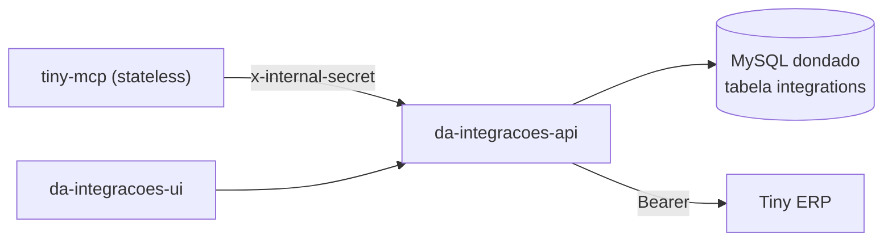

# da-integracoes-module

Módulo de Integrações da Central Don Artesano: guarda credenciais e faz o OAuth de sistemas externos num lugar só. MCPs e ferramentas internas consomem por um proxy, sem tratar token.

| Pasta | O que é |
|---|---|
| [`da-integracoes-api`](da-integracoes-api/README.md) | API Fastify (porta 4001): credenciais, OAuth, renovação de token, proxy |
| [`da-integracoes-ui`](da-integracoes-ui/README.md) | Tela Vite/React para salvar credenciais e conectar |
| [`docs/ARQUITETURA.md`](docs/ARQUITETURA.md) | Arquitetura completa, fluxos, incidentes e pendências |

## Em uma frase

`MCP (ex.: tiny-mcp)` → `x-internal-secret` → `da-integracoes-api /api/proxy/tiny/*` → lê o token no MySQL → `API do Tiny`.



## Deploy (Easypanel, projeto `dondado`)

- Apps `da-integracoes-api` e `da-integracoes-ui`, build por Nixpacks a partir deste repositório (branch `main`).
- Auto-deploy desligado: todo deploy é manual.
- API publicada em `https://integracoes-api.solares.systems`.

## Rodar local

```bash
cd da-integracoes-api && npm install && npm start   # precisa de DATABASE_URL, INTERNAL_SECRET, INTERNAL_KEY
cd da-integracoes-ui  && npm install && npm run dev
```

## Regras

- Segredos só em variável de ambiente (Easypanel). Nunca no código nem no commit.
- Consumidor novo (outro MCP) usa o proxy com `x-internal-secret`; não lê token direto do banco.
