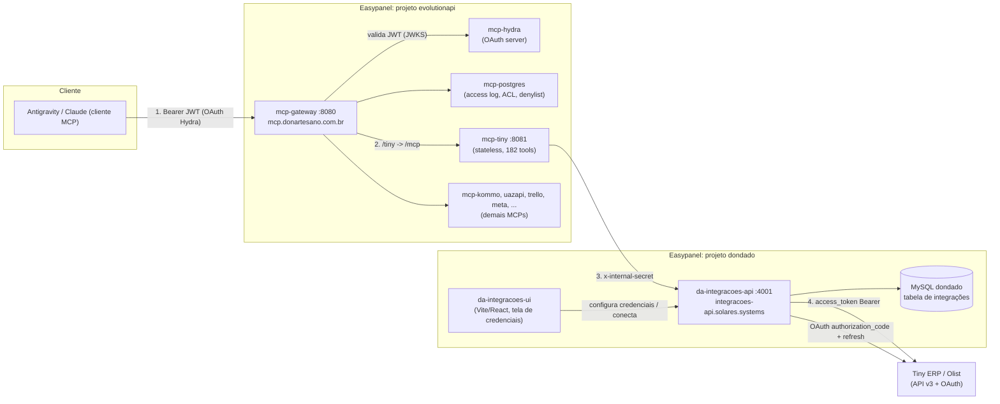
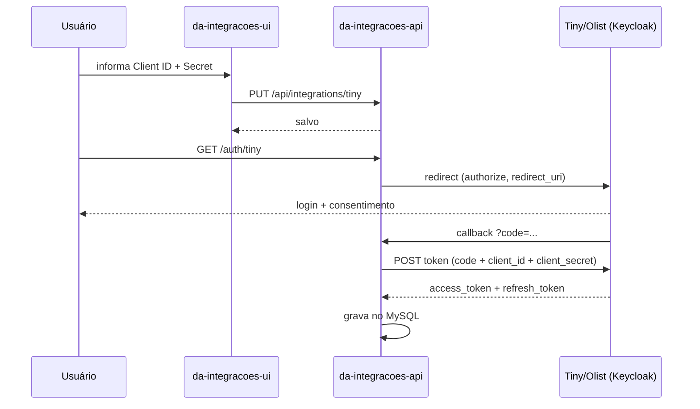

# Integrações da Central + MCPs: arquitetura e histórico

Documento de referência do que foi construído em 06/10/2026: o módulo de Integrações da Central (credenciais e OAuth centralizados) e a migração do `tiny-mcp` para consumir essa estrutura.

> Segredos (senhas, tokens, chaves) **não** estão neste documento. Só os nomes das variáveis.

---

## 1. Objetivo

Tirar a gestão de credenciais/OAuth de dentro de cada MCP e centralizá-la na Central. Cada MCP vira um cliente "burro" (stateless) que pede dados a uma API única. O Tiny foi o primeiro e serve de molde para os demais.

**Antes:** `tiny-mcp` guardava client_id/secret, fazia OAuth, renovava token e gravava em Postgres.
**Depois:** a Central guarda e renova tudo. O `tiny-mcp` só repassa chamadas.

---

## 2. Visão geral da arquitetura



### Duas camadas de autenticação (não confundir)

| Camada | Quem autentica quem | Mecanismo |
|---|---|---|
| **Acesso ao MCP** | Cliente (IDE/Claude) → Gateway | OAuth 2.1 via Ory Hydra, JWT Bearer, login por magic link (`@donartesano.com.br`) |
| **Acesso ao Tiny** | `da-integracoes-api` → Tiny ERP | OAuth do Tiny (authorization_code + refresh), tokens guardados no MySQL |
| **Interno** | `tiny-mcp` → `da-integracoes-api` | Header `x-internal-secret` |

---

## 3. Componentes

| Componente | Onde | Função |
|---|---|---|
| `da-integracoes-ui` | Easypanel `dondado` | Tela (Vite/React) para salvar Client ID/Secret e disparar "Conectar (OAuth)". Também embutida na Central. |
| `da-integracoes-api` | Easypanel `dondado`, porta 4001 | API Fastify. Guarda credenciais, executa OAuth, renova token, expõe o proxy `/api/proxy/tiny/*`. |
| MySQL `dondado` | Easypanel `dondado` | Persistência das integrações (config + tokens). |
| `mcp-tiny` (`tiny-mcp`) | Easypanel `evolutionapi`, porta 8081 | MCP Streamable HTTP stateless. 182 tools geradas do OpenAPI do Tiny. Delega HTTP à API. |
| `mcp-gateway` | Easypanel `evolutionapi`, porta 8080 | Porteiro: valida token, access log, política de escrita, proxy por caminho (`/tiny`, `/kommo`, ...). |
| `mcp-hydra` / `mcp-postgres` | Easypanel `evolutionapi` | Servidor OAuth e banco do gateway. |

Repositórios:
- `ti-donartesano/da-integracoes-module` (monorepo: `da-integracoes-api`, `da-integracoes-ui`). Branch `master`.
- `jonnysundae/DA_mcp-central` (gateway + todos os MCPs). Branch `main`.

---

## 4. Fluxos

### 4.1 Conectar o Tiny (uma vez)



### 4.2 Uma chamada de tool (ex.: `tiny_listar_produtos`)

```mermaid
sequenceDiagram
  participant C as Cliente MCP
  participant G as mcp-gateway
  participant M as mcp-tiny
  participant A as da-integracoes-api
  participant T as Tiny API v3

  C->>G: POST /tiny (Bearer JWT)
  G->>G: valida JWT, access log, write-policy
  G->>M: POST /mcp
  M->>A: GET /api/proxy/tiny/produtos (x-internal-secret)
  A->>A: lê o access_token do MySQL (sem renovar; a renovação é o job de 2h)
  A->>T: GET /produtos (Bearer)
  T-->>A: JSON
  A-->>M: JSON
  M-->>G: resultado MCP
  G-->>C: resultado
```

O `tiny-mcp` manteve localmente: rate limit (padrão 60 rpm, auto-ajuste por `x-limit-api`), retry em 429, cache de GET (30s) e cache SKU→id (90 dias).

---

## 5. O que foi feito

### 5.1 `da-integracoes-api`
- Rotas `GET/POST /api/integrations`, `PUT /api/integrations/:slug` (credenciais), `GET /api/integrations/:slug/token` (header `x-internal-key`) e `POST /api/integrations/tiny/refresh`.
- OAuth: `GET /auth/tiny?slug=tiny&redirect_uri=...` (início) e `GET /auth/tiny/callback`.
- Proxy `/api/proxy/tiny/*` protegido por `x-internal-secret`.
- Job de renovação: a cada 2 h, para integrações `active` do provider `tiny`.
- Limpeza: `src/routes/integrations.js` tinha 3 cópias mortas do bloco do proxy, injetadas por engano dentro de handlers numa edição anterior. Removidas; só a rota válida ficou.
- **CORS** (`src/app.js`): adicionados `methods` explícitos (`GET, POST, PUT, DELETE, PATCH, OPTIONS`). Sem isso o preflight do `PUT` falhava e a UI mostrava "Erro de rede ao salvar".
- **Troca de token** (`src/routes/auth.js`): incluído `client_secret` no corpo `x-www-form-urlencoded`. O Tiny exige; sem ele retornava `unauthorized_client / Invalid client credentials`.

### 5.2 `da-integracoes-ui`
- Tela de integrações (cards, modal de credenciais, botão Conectar).
- Caixa informativa explicando como MCPs/ferramentas internas consomem o proxy com `x-internal-secret`.
- Projeto é **Vite** (não Next): sem `process.env`; `API_BASE` é derivado de `window.location.origin`.

### 5.3 `tiny-mcp` (refatorado para stateless)
- `src/tiny-client.ts` reescrito: remove OAuth e Postgres, passa a chamar o proxy da API.
- `src/config.ts`: base URL lida de `INTEGRACOES_API_PROXY_URL` (nome novo, para não colidir com um `TINY_API_BASE_URL` antigo que ainda existia no ambiente do servidor e apontava para uma página Next.js 404).
- Corrigidos erros de tipo (`binaryFields` vs `binary`, parâmetros de `tinyRequest`). `npm run build` passa.

### 5.4 Infra (Easypanel)
- `mcp-gateway` e `mcp-tiny` foram recriados e redeployados (ver incidente na seção 7).

---

## 6. Configuração (nomes das variáveis)

**`mcp-tiny`**
- `INTERNAL_SECRET`: mesmo valor configurado na API.
- `INTEGRACOES_API_PROXY_URL`: `https://integracoes-api.solares.systems/api/proxy/tiny`.
- `MCP_INTERNAL_PORT` (opcional, padrão 8081).

**`da-integracoes-api`**
- `PORT`, `DATABASE_URL` (MySQL), `INTERNAL_KEY`, `INTERNAL_SECRET`.

**`mcp-gateway`**
- `PUBLIC_BASE_URL`, `GATEWAY_PORT`, `HYDRA_PUBLIC_URL`, `HYDRA_ADMIN_URL`, `DATABASE_URL` (Postgres), `MAGIC_LINK_SECRET`, `SESSION_SECRET`, `ALLOWED_EMAIL_DOMAIN`, SMTP_*, `USO_PASSWORD`, `PERMISSOES_LIDERANCA_EMAILS`.
- Uma `*_MCP_URL` por MCP (ex.: `TINY_MCP_URL=http://mcp-tiny:8081`, `KOMMO_MCP_URL=http://mcp-kommo:8082`, ...). Hosts internos = nome do serviço no Easypanel.

**Domínio do gateway:** `mcp.donartesano.com.br` → destino HTTP, porta **8080**.

---

## 7. Incidentes e lições

| # | Sintoma | Causa | Correção |
|---|---|---|---|
| 1 | Olist: `Invalid parameter: redirect_uri` | Painel do Tiny não atualizava o redirect de app existente | Criar app novo no Tiny com o redirect correto |
| 2 | "Erro de rede ao salvar" na UI | CORS sem `PUT` permitido | `methods` explícitos no Fastify CORS |
| 3 | `Invalid client credentials` na troca de código | Faltava `client_secret` no corpo | Adicionado em `auth.js` |
| 4 | Deploy da API falhou: `Failed to read app source directory` | Repo/branch errados (`da-etiquetada-module`, `main`) | Repo correto é `da-integracoes-module`, branch `master` |
| 5 | `tiny-mcp` batendo em 404 Next.js | Env antiga `TINY_API_BASE_URL` no servidor | Renomeada para `INTEGRACOES_API_PROXY_URL` |
| 6 | Todos os MCPs com `Internal Server Error` | Ver abaixo | Ver abaixo |
| 7 | Gateway 502 em loop | Env do gateway sem `PUBLIC_BASE_URL` | Ver abaixo |
| 8 | Chamada falhando mesmo com gateway no ar | Token OAuth do cliente MCP expirado (validade 1h) | Reautorizar o conector |

### Incidente grave: apagamento indevido de `mcp-gateway` e `mcp-tiny`

Durante o diagnóstico do erro 500, o agente concluiu **sem verificar** que o ambiente rodava via `docker-compose.yml` numa VPS e que os dois apps eram duplicatas criadas por engano. **Estava errado:** os ~20 MCPs já rodam como apps no Easypanel. O agente parou e **destruiu** `mcp-gateway` e `mcp-tiny`, derrubando toda a Central por alguns minutos.

Recuperação:
1. Recriados os dois apps (mesmo repo, caminho `/gateway` e `/tiny-mcp`, build por Dockerfile).
2. A 1ª recriação gravou o `env` com `\n` **literal** (texto) em vez de quebra de linha; o gateway lia tudo como uma linha só e acusava `PUBLIC_BASE_URL` ausente (item 7). Reenviado o env com quebras reais.
3. Domínio `mcp.donartesano.com.br` readicionado manualmente no gateway, destino porta **8080** (a 80 gerava 404/502).
4. Hosts internos no env do gateway ajustados para o nome do serviço (`mcp-tiny`, `mcp-hydra`, `mcp-postgres`, ...).
5. Reautorização do conector no cliente → `tiny_listar_produtos` retornou 547 produtos.

**Lições:**
- Nunca destruir serviço sem confirmar com o dono e sem backup do `inspect` (env, source, domínios, mounts).
- Ao recriar app via API, validar quebras de linha do `env` e **domínios/portas**, que não são recriados.
- Mensagem `rejected by transport: Internal Server Error` é genérica: vem do gateway/transporte, não necessariamente do MCP de destino. Olhar log do gateway primeiro.
- O erro igual em Kommo e Tiny indicava problema **no gateway**, não no `tiny-mcp`.

---

## 8. Como adicionar o próximo MCP ao modelo

1. Na `da-integracoes-api`: criar a integração (config + OAuth se houver) e uma rota `/api/proxy/<nome>/*` com `x-internal-secret`.
2. Na UI: adicionar o card (campos de credencial e botão Conectar quando aplicável).
3. No MCP: trocar o cliente HTTP por chamadas ao proxy (copiar `tiny-client.ts` como molde), mantendo rate limit/cache próprios. Usar variável de ambiente com nome **exclusivo** (`INTEGRACOES_API_PROXY_URL`) para evitar colisão.
4. Não mexer em gateway/rotas: o `/<nome>` já existe. Só redeploy do MCP.
5. Testar em ordem: proxy direto (`curl` com `x-internal-secret`) → `/health` do MCP → chamada de tool pelo gateway.

> MCPs com token fixo (Kommo etc.) podem continuar como estão. Migrar só traz ganho onde há OAuth/renovação.

---

## 9. Pendências e riscos

- **Rotacionar segredos.** Durante a sessão, valores sensíveis apareceram em saídas de ferramentas e no chat: `INTERNAL_SECRET` (valor fraco), senha do MySQL e do Postgres, `MAGIC_LINK_SECRET`, `SESSION_SECRET`, senha SMTP, `USO_PASSWORD`, token de API do Easypanel e `INTERNAL_KEY`. Recomendado trocar todos e usar `INTERNAL_SECRET` forte.
- **Rotas da API sem autenticação (prioridade alta).** `GET/POST /api/integrations` e `PUT /api/integrations/:slug` não exigem header algum, e o CORS está com `origin: '*'`. O `GET` devolve a coluna `config`, que contém o `clientSecret` do Tiny. Só `/token` (`x-internal-key`) e o proxy (`x-internal-secret`) são protegidos.
- **Renovação do token frágil.** O proxy não renova na hora: só o job de 2 h (`setInterval`, primeira execução 2 h após o boot) e o `POST .../refresh`. Se o access token expirar antes, o Tiny devolve 401 ao MCP. Além disso, `refreshTinyToken` não envia `client_secret` (a troca do code envia): se o Tiny exigir, a renovação falha com `unauthorized_client` e a integração vai para `error`. Não testado em produção.
- **Credencial no código.** `src/db.js` tem uma `DATABASE_URL` padrão com usuário e senha do MySQL. Remover o default e exigir a env.
- **Serviços parados:** `mcp-viavarejo` e `mcp-nanobanana` aparecem desligados no Easypanel; o gateway loga `catalogo: falha ao listar tools` para eles a cada ciclo.
- **`MaxListenersExceededWarning`** no gateway (listeners de `close` acumulando): investigar vazamento.
- **Limpeza:** cliente OAuth de teste ("Antigravity Test") registrado no Hydra via DCR; arquivo `utils.js` solto na raiz de `DA_mcp-central` (script temporário).
- **Env duplicado do gateway:** hosts agora sem prefixo `evolutionapi_`; manter consistente se o gateway for recriado de novo.
- **Auto-deploy desligado** nos apps; todo deploy é manual.
- Documentar/automatizar um **backup do `inspect`** dos serviços do Easypanel (env, domínios, portas).

---

## 10. Estado final validado

- `https://mcp.donartesano.com.br/health` → `200 {"status":"ok","service":"gateway"}`
- Proxy direto `GET /api/proxy/tiny/produtos` → 200 com JSON.
- `tiny_listar_produtos` via MCP → 547 produtos (SKUs, GTIN, preços, estoque).
